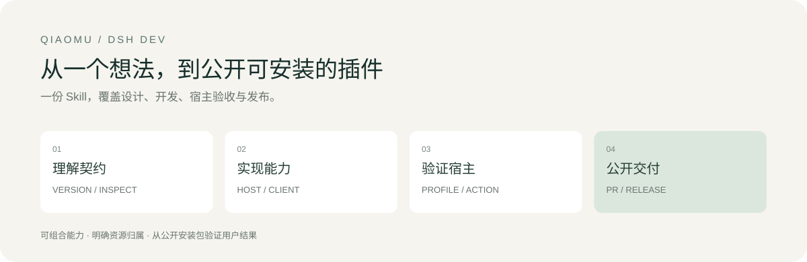
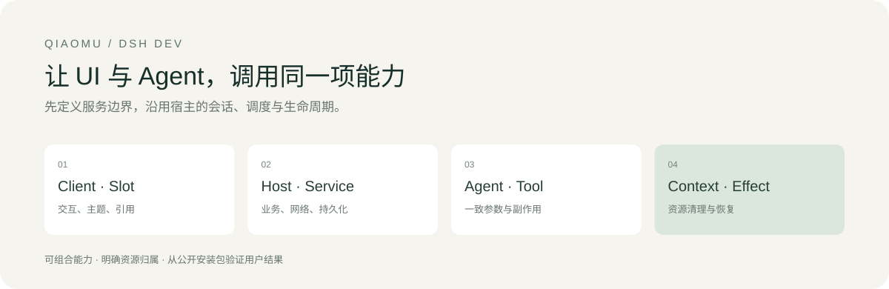
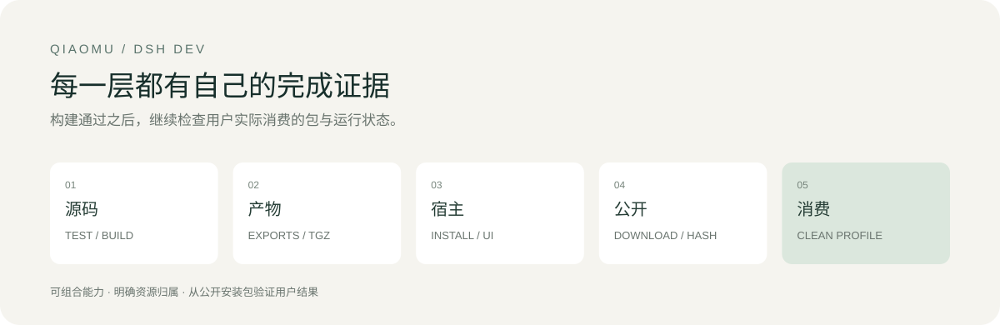

# qiaomu-dsh-dev

**把 DeepSeek Harness 插件，从一个想法做到真实可用、公开可安装。**

中文优先 · [English](#english) · [开发入口](SKILL.md) · [设计理念](references/design-philosophy.md) · [研究依据](reports/research-20261001.md)



> 上图是工作流示意，不是插件运行截图。版本 **0.2.0** · 单包自包含 · Python 3.9+ · MIT

## 只安装这个 Skill

```bash
npx skills add joeseesun/qiaomu-dsh-dev
```

无需另外安装设计、发布或开发 Skill。包内包含开发配方、故障定位、脚手架、tgz 审计、公开下载校验、验收模板和图文 README 模板。它适用于支持 Agent Skills 的编码代理。

开发仍需目标 DSH、Node/包管理器；发布需要 GitHub 权限，npm 仅在选择该渠道时需要。Skill 安装不会安装 DSH、修改日用 profile 或替你配置凭据。脚本只在任务需要时显式运行。

使用前准备：

- [ ] 可以读取和构建目标插件仓库；自带脚本可用 Python 3.9+。
- [ ] 已安装目标 DSH，有明确的独立测试 profile 与真实宿主验收入口。
- [ ] 发布时具备 GitHub 权限，并明确选择的分发渠道。

## 你可以直接这样说

> 用 qiaomu-dsh-dev 做一个 DSH 待办插件：界面与 Agent 工具共用 Host 操作，保留本地数据，安装到独立 profile 验收。完成后通过 PR 发布到 GitHub，README 要有真实操作截图和可安装 tgz。

> RSS 工具可用，但阅读面板报 remote.rss 未注入。检查实际 DSH 版本、Client 依赖、构建包和安装副本，修复后在宿主中验证两篇文章的选段问答。

> 审查这个 DSH 插件的发布包和图文 README。只读检查 exports、patch、离线资产、真实截图来源、安装命令与兼容证据。

## 你会得到什么

| 环节 | 交付 |
| --- | --- |
| 理解 DSH | 插件组合、Service Definition/Provider/Consumer、Context 生命周期、session log 与稳定扩展点 |
| 开发 | Host/Client/Remote 边界、共享业务操作、原生会话、i18n、数据迁移与失败恢复 |
| 修复 | 对照源码、实际构建、profile 安装与进程加载，定位失效层 |
| 验收 | 真实成功/失败路径、停用/启用、草稿、主题、窄屏、媒体与文件产物 |
| 发布 | feature branch → PR → CI → merge → Release/tgz → 公开下载 → 干净安装 |
| 展示 | 双语产品 README、真实操作截图与来源、安装/隐私/卸载说明、市场资料 |

## 理解“一切皆插件”



DSH 的扩展能力来自可组合的服务、事件与可撤销 effect。这个 Skill 先确定能力由谁提供、谁调用、谁清理，再选实现：业务操作放 Host，UI 与工具调用同一逻辑；会话事实以日志为准，缓存只作派生；UI 通过真实 Slot 与主题 token 加入宿主。

[理念与扩展点](references/design-philosophy.md) · [实现配方](references/implementation-recipes.md) · [架构核验](references/architecture.md)

## 自带四个小工具

从本 Skill 目录执行，替换示例路径：

```bash
# 只读诊断：包、exports、Git 状态、CLI 候选
python3 scripts/dsh_dev.py doctor --repo /path/to/plugin

# 创建最小 Host bundle，不覆盖已有目录
python3 scripts/dsh_dev.py init /path/to/new-plugin --name qiaomu-demo-dsh

# 检查真正给用户的 tgz，不执行包代码
python3 scripts/dsh_dev.py audit /path/to/package.tgz

# 匿名公开下载 + 候选 SHA256 + tgz 审计
python3 scripts/dsh_dev.py verify-download --url PUBLIC_HTTPS_TGZ_URL --sha256 EXPECTED_SHA256
```

脚手架包含 manifest、Host 入口、bundle patch、en/zh 展示元数据、icon 和文档模板；Host 的 apply 是空起点，业务功能仍须实现。工具不会推断运行成功，也不会替代 Loader YAML 与真实宿主验收。

## Troubleshooting · 用近期开发经验解决常见卡点

- **构建通过但面板没出现**：核对 factory、Slot、运行 inject、包元数据与实际安装副本。
- **切文章串上下文或抖动**：材料/选段/会话分离，保留 composer，验证迟到响应与草稿。
- **改样式影响播放器或点击**：实际 hit-test、webview 布局与播放 owner 单独验证。
- **本地好用但他人装不了**：tgz 的 exports、声明、patch、媒体资源与公开下载另验。
- **只有源码公开或目录标签**：清楚报告 Release、独立安装、市场提交、录用与可见阶段。

参考最近 **15 个相关开发聊天**，覆盖 Home、RSS、Reader、Radio；聊天状态截至 2026-10-01，正在进行的开发不算已验收。[复盘案例](references/cases.md)

## 图文 README 与发布

[README 模板](templates/PLUGIN_README.md) 从用户任务出发：价值、真实主界面、安装、三步使用、兼容、隐私、卸载与恢复。每张图注明实际版本/构建来源；没有实机时可用明确标注的概念图，不伪造运行成果。



[发布操作手册](references/release-runbook.md) · [图文标准](references/illustrated-readme.md) · [验收模板](templates/ACCEPTANCE.md) · [市场投稿](references/distribution-and-marketplaces.md)

当前请求或已明确授权的长期发布偏好都有效，不重复索取授权。没有发布授权时完成本地准备；只读审查保持只读。GitHub Topics 与社区目录提供发现，不表示 DeepSeek 官方维护或背书。

## 来源与适用边界

以 [DSH 官方架构](https://github.com/deepseek-ai/deepseek-harness/blob/master/docs/architecture.md)和[官方持久插件指南](https://github.com/deepseek-ai/deepseek-harness/tree/master/packages/preset/agent-preset/skills/cordis-plugin-development)为主要依据，学习官方 UI/review/pre-push Skills，以及 SSH、Remote、Vision 三类社区插件的互补机制。[来源与取舍](reports/research-20261001.md)

DSH 正在快速迭代。每次开发先查安装版本和契约；历史内部 Client 依赖不是新插件的稳定模板。已验证包工具、Host 脚手架的安装启动与 Skill 安装；尚无复杂插件同题对比，不声称世界第一。

本 Skill 不适用于 Obsidian 专属插件、普通网页或临时 Cordis Run 代码。遇到连接/宿主权限不足，保留具体缺证层与最短复测步骤。

## 检查这个包

```bash
python3 -m unittest discover -s tests -v
```

发布维护时已通过 `validate_skill.py` 的结构检查；日常使用不需要这个外部维护工具。

测试覆盖缺声明/exports、缺bundle、危险archive路径、Client入口和无覆盖创建等消费端失败。触发用例和发布证据在 [evals](evals/) 与 [reports](reports/)。

## English

Build, debug, verify and publish persistent DeepSeek Harness plugins with one self-contained Agent Skill. It includes version-aware design guidance, Host/Client/Remote recipes, a no-dependency Python doctor and Host scaffold, archive audits, public-download SHA256 verification, release instructions and illustrated bilingual README templates.

Install: `npx skills add joeseesun/qiaomu-dsh-dev`. You still need DSH, the plugin toolchain, a test profile and GitHub access for publication. The Skill does not install the host or modify a profile implicitly. Scaffold output is an empty Host starting point, not a completed feature.

Verification distinguishes source, artifacts, profile, live user behavior and public installation. Publishing uses existing user authorization. Protect data and drafts, reuse verified contracts, preserve upstream licenses, and report untested versions and platforms explicitly.

<!-- qiaomu-profile:start -->
## 关于向阳乔木

向阳乔木（乔向阳 / Joe）是一位实践型 AI 产品与内容创作者，长期把前沿 AI 变化转译成可复用的工作流、产品判断、AI 编程实践、AI 搜索实践和 GEO/AI 营销方法。

- 个人网站: https://qiaomu.ai
- 博客: https://blog.qiaomu.ai
- X: https://x.com/vista8
- GitHub: https://github.com/joeseesun/
- 微信公众号: 向阳乔木推荐看

### 支持与关注

| 打赏支持 | 微信公众号 |
|---|---|
|  |  |
| 感谢支持乔木持续分享 AI 实践 | 扫码关注「向阳乔木推荐看」 |

<!-- qiaomu-profile:end -->

## License

MIT · Copyright (c) 向阳乔木 · [X](https://x.com/vista8) · [GitHub](https://github.com/joeseesun/)
